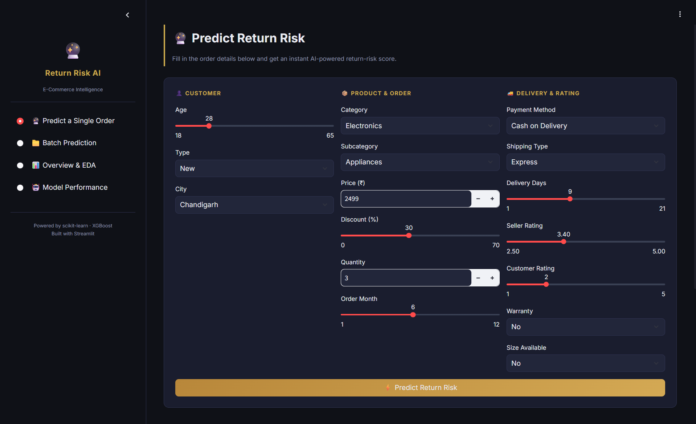
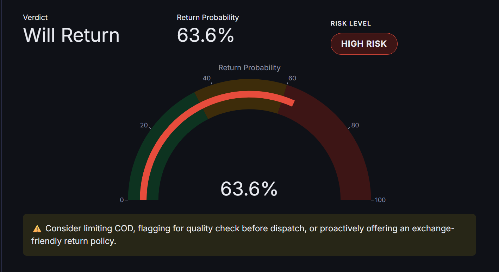

# 🛒 Return Risk AI — E-Commerce Product Return Prediction

**Predict whether an order will be returned — before it ships.**

An end-to-end machine learning app that scores e-commerce orders for return risk in real time, using customer, product, delivery, and payment signals. Built on 15,000 real-world-style Indian e-commerce transactions.

<p align="center">
  <a href="https://commerce-product-return--arushigarg525.replit.app/"><b>🔴 Live Demo</b></a>
  ·
  <a href="#-features">Features</a>
  ·
  <a href="#-tech-stack">Tech Stack</a>
  ·
  <a href="#-run-locally">Run Locally</a>
  ·
  <a href="#-model-performance">Model Performance</a>
</p>

<p align="center">
  
  
  
  
  
</p>

---

## 🌐 Live App

**👉 [commerce-product-return--arushigarg525.replit.app](https://commerce-product-return--arushigarg525.replit.app/)**

> Hosted on Replit's free tier — if the app is asleep, the first load may take a few seconds to wake up.

---

## 📸 Preview

| Predict a Single Order |
|:---:|
|  |


| Instant Risk Verdict |
|:---:|
 |

---

## ✨ Features

- **🔮 Predict a Single Order** — fill in customer, product, and delivery details and get an instant AI-powered return-risk score with a live gauge and a clear verdict (Will Return / Not Returned).
- **📁 Batch Prediction** — upload a CSV of orders and download every order scored with return probability and risk level in one click.
- **📊 Overview & EDA** — interactive charts breaking down return rate by category, discount level, payment method, delivery time, and return reason.
- **🤖 Model Performance** — leaderboard comparing five trained models (Logistic Regression, Decision Tree, Random Forest, Gradient Boosting, XGBoost) side by side on Accuracy, F1, ROC-AUC, Precision, and Recall, plus feature importance rankings.
- **⚠️ Actionable recommendations** — high-risk orders come with concrete suggestions (limiting COD, pre-dispatch quality checks, proactive exchange policies).

---

## 🧠 How It Works

The model is trained on 15,000 orders with features like customer age, product price and category, discount percentage, delivery days, seller and customer ratings, payment method, and warranty availability. Engineered features (e.g. high discount flag, late delivery flag, festival-season flag, actual post-discount price) feed into five candidate classifiers, and the best performer by ROC-AUC is selected automatically — no manual step required.

The app **trains itself on first launch** in whatever environment it's deployed to, rather than shipping a pre-pickled model. This avoids version-mismatch errors between environments (a common source of `ModuleNotFoundError` when a model pickled with one library version is loaded with another) and makes the app portable across Replit, Streamlit Cloud, Render, or any other host.

---

## 🛠️ Tech Stack

| Layer | Tools |
|---|---|
| UI | [Streamlit](https://streamlit.io/) |
| Modeling | scikit-learn, XGBoost |
| Data | pandas, NumPy |
| Visualization | Plotly |
| Hosting | Replit |

---

## 📂 Project Structure

```
e-commerce-product-return-/
├── app.py                          # Streamlit app (UI + prediction logic)
├── train_model.py                  # Feature engineering + model training pipeline
├── ecommerce_product_returns.csv   # Dataset (15,000 orders)
├── requirements.txt                # Python dependencies
├── Product_Return_Prediction_System.ipynb   # Original exploratory notebook
└── README.md
```

---

## 🚀 Run Locally

```bash
git clone https://github.com/Shinearushi525/e-commerce-product-return-.git
cd e-commerce-product-return-
pip install -r requirements.txt
streamlit run app.py
```

The first launch trains the model automatically (a few seconds) and caches it for the rest of the session. Open the local URL Streamlit prints — usually `http://localhost:8501`.

---

## 📈 Model Performance

Five models are trained and ranked automatically by ROC-AUC on a held-out 20% test split. The best model is selected live — check the **Model Performance** tab in the app for current numbers, since they're computed fresh from the CSV every time the app trains, not hardcoded.

> Note: this is a synthetic dataset with realistic-looking but randomly generated patterns, so absolute scores are modest (models land in the 55–65% ROC-AUC range) — the value here is in the end-to-end pipeline and UI, not claiming state-of-the-art accuracy on real production data.

---

## 🗺️ Roadmap Ideas

- [ ] Add SHAP-based explanations for individual predictions
- [ ] Add authentication for batch upload in production use
- [ ] Persist historical predictions for trend tracking
- [ ] A/B test alternate models (LightGBM, CatBoost)

---

## 📄 License

MIT — free to use, modify, and build on.

---

## 🙋 Author

**Arushi Garg**
[GitHub](https://github.com/Shinearushi525) · [Live App](https://commerce-product-return--arushigarg525.replit.app/)
